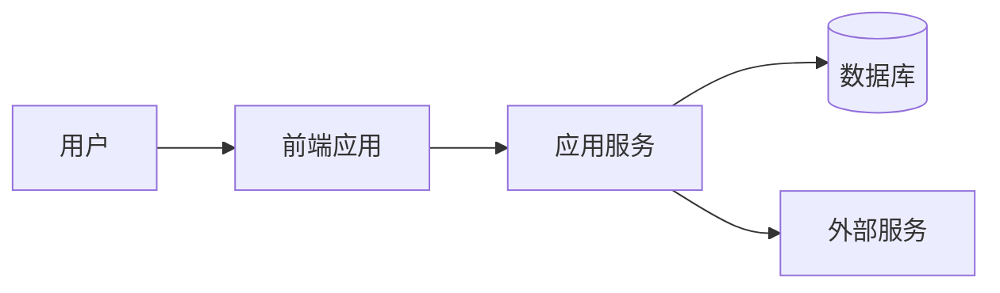
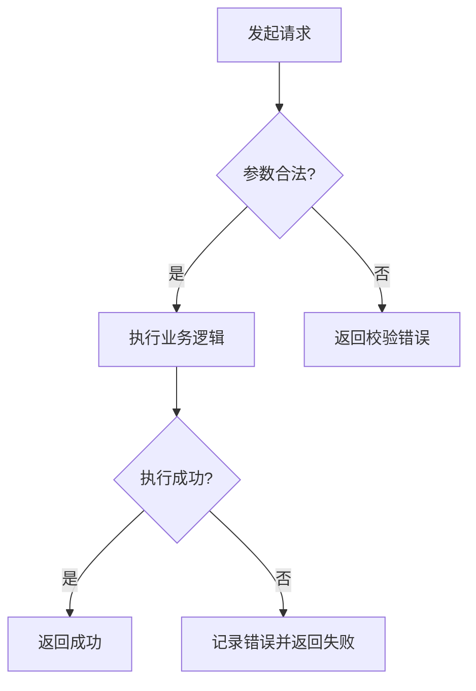
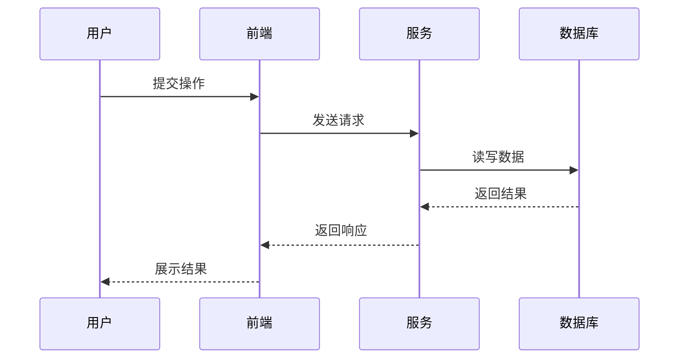

# 中文 OpenSpec 编写规范

> 本文件用于约束 `superpowers-openspec` 输出中文、可执行、可审查的 spec 文档。

## 第一原则：这是规范阶段技能

本文件服务于 `superpowers-openspec`。

它只负责以下阶段：

1. 分析
2. 规范
3. Spec Review

后续拆解、实现、测试、最终 review 由顶层 `superpowers` 继续推进。

### 触发条件

遇到以下请求时，优先使用本规范：

- 用户明确要求先分析、先写 spec、先做详细设计再开发
- 用户要求把口语化需求、会议纪要、草稿整理成可执行规范
- 用户要求 `superpowers` 先进入规范阶段
- 用户要求先拆任务、先开工、先补实现，但上下文仍需要定义规则、流程、接口或状态

## 第二原则：Spec First

只要任务涉及新增或调整以下内容，就必须先写 spec，再写代码：

- 功能
- 流程
- 页面
- 接口
- 数据结构
- 状态流转
- 业务规则
- 模块边界

**没有 spec，不得编码。**

若用户催促直接实现，也要先补最小可行 spec，再继续。

如果用户只要求规范阶段产物，那么 spec 完成后应停在规范阶段，不要顺手进入拆任务或实现建议。

## 第三原则：必须使用 OpenSpec 结构

默认输出结构如下：

1. 文档头信息
2. 背景与目标
3. 范围与非范围
4. 角色与对象定义
5. 核心规则
6. OpenSpec 需求条目
7. 数据与结构定义
8. 接口与交互约束
9. 架构图（Mermaid）
10. 流程图（Mermaid）
11. 时序图（Mermaid）
12. 异常与边界处理
13. 验收标准
14. 待确认项
15. Spec Review 记录
16. 文档自检结果

除非用户明确要求缩减，否则不要跳过这些部分。

## 第四原则：必须全中文

- 标题使用中文
- 正文使用中文
- 规则说明使用中文
- review 记录使用中文

代码标识、接口路径、字段名可以保留原始技术名称，但解释必须为中文。

## 第五原则：Mermaid 三图强制

### 架构图

必须说明：

- 参与方
- 系统边界
- 核心模块
- 模块关系
- 关键数据流

示例：

### 流程图

必须说明：

- 触发入口
- 主流程
- 判断分支
- 成功路径
- 失败路径

示例：

### 时序图

必须说明：

- 谁发起
- 谁接收
- 中间调用链
- 成功返回
- 失败返回

示例：

## 第六原则：需求必须可追踪

推荐使用编号：

- FR-xxx：功能需求
- BR-xxx：业务规则
- DR-xxx：数据需求
- API-xxx：接口约束
- UI-xxx：交互约束
- NFR-xxx：非功能需求
- AC-xxx：验收标准

后续说明尽量引用编号，而不是重复口语描述。

## 第七原则：规则必须具体，禁止模糊词

以下表达不能直接通过，除非补全定义：

- 支持
- 优化
- 增强
- 合理处理
- 按业务规则处理
- 友好提示
- 必要时
- 标准流程

必须补充：

- 触发条件
- 执行动作
- 输出结果
- 判断标准

## 第八原则：异常路径必须单列

至少覆盖：

- 输入非法
- 权限不足
- 状态不允许
- 数据不存在
- 重复提交
- 并发冲突
- 外部依赖失败
- 用户取消

不要把异常处理埋在正文段落里。

## 第九原则：Review 不是可选项

spec 初稿写完后，必须 review。

### Review 检查项

- 结构是否完整
- 是否全中文
- 是否存在模糊词
- 是否缺少 Mermaid 三图
- 是否缺少异常处理
- 是否缺少验收标准
- 图与正文是否一致
- 数据与流程是否一致
- 是否足够支持开发

### Review 输出格式

- Review 轮次
- Review 状态
- 问题清单
- 修订动作
- 当前结论

如 review 未通过，必须回改并再次 review。

## 第十原则：设计一致性约束

本 skill 内建以下约束：

- 文档必须结构化输出
- 图必须是正式交付物
- 涉及状态、字段、接口时，要保持前后一致
- 与现有实现冲突时，先列差异，不得直接硬改
- 涉及前端页面时，可补 ASCII 布局图

## 第十一原则：最终文档必须能指导 AI 开发

文档与规范阶段至少要能清楚回答：

- 分析结论是什么
- spec 是什么
- review 结论是什么

同时，文档至少要能清楚回答：

- 要做什么
- 为什么做
- 不做什么
- 谁触发
- 流程怎么走
- 数据怎么定义
- 异常怎么处理
- 如何验收

如果文档还需要大量猜测才能实现，则说明 spec 不合格。
