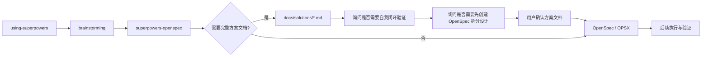

# 技能使用顺序

本文件说明 `superpowers-openspec` 在整体流程中的位置。

## 推荐顺序

## 分工关系

- `using-superpowers`
  - 负责识别当前任务是否可能需要进入规范阶段

- `brainstorming`
  - 负责把目标、范围和约束先澄清清楚

- `superpowers-openspec`
  - 负责面向 OpenSpec 组织方案、规范与计划
  - 当用户要求完整方案文档时，先生成并等待用户确认 `docs/solutions/*.md`
  - 在请求用户确认方案文档前，询问是否需要方案文档自我闭环验证；该验证由用户决定，不是强制步骤
  - 闭环验证完成后，询问是否需要先创建 `docs/solutions/references/<主题>-OpenSpec-拆分设计.md`；该拆分设计由用户决定，不是强制步骤
  - 当方案文档已确认或无需完整方案文档时，选择合适的 `/opsx:*` 入口

- OpenSpec / OPSX
  - 负责生成和维护官方规范产物
  - 例如 `proposal.md`、`spec.md`、`design.md`、`tasks.md`

- 后续执行与验证
  - 负责消费上述 OpenSpec 产物继续推进实现、验证和收尾

## 使用原则

- superpowers 负责调度
- OpenSpec 负责规范
- `superpowers-openspec` 负责组织方案、规范与计划

如果某份说明把 `superpowers-openspec` 写成“OpenSpec 的替代规范体系”，那就是定位错误。

如果某份说明把 `docs/solutions/*.md` 写成 OpenSpec 官方 artifact，或者要求新增 `sources.md` 记录来源关系，那也是定位错误。来源关系应写入 `proposal.md`。
